# Project-AeroTurbine-Solutions-Building-an-Agentic-Supply-Chain

# **Project Submission**

Student Name: Richard Vlas <br>
Date: December 30, 2025

## **Part 1: Azure Resource Deployment**

Below are the required screenshots demonstrating the successful deployment and configuration of the Azure resources including AI Foundry project, model deployments, storage table, indexer status, and Azure AI Search functionality.

### **1.1 AI Foundry & Project**

**AI Foundry Project Home Screen Screenshot** <br> The screenshot displays the AI Foundry project dashboard with the project name "finalProjectC1"

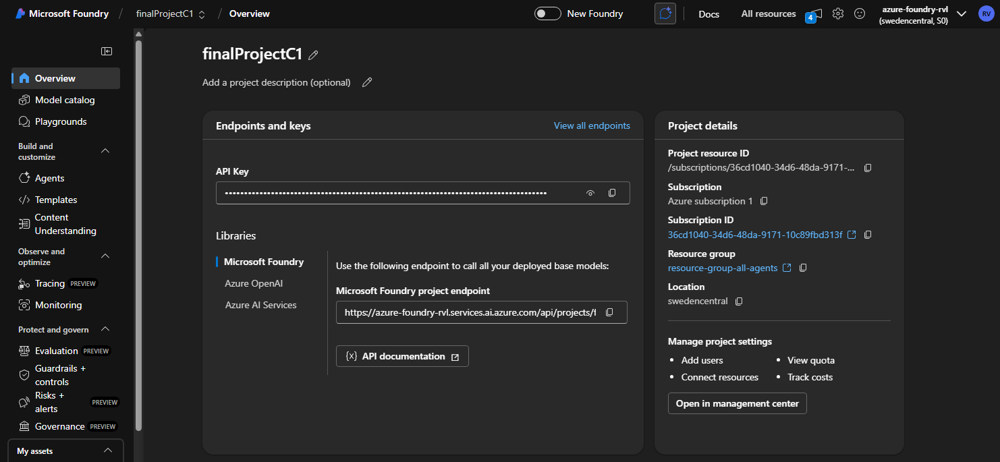

### **1.2 Model Deployments**

Must show gpt-4 (or 4.1) and gpt-4o-mini (or 4.1 mini) deployments.

**Model Deployments Screenshot** <br> This screenshot shows the Azure AI Foundry "Deployments" page with both gpt-4.1 and gpt-4.1-mini models deployed.

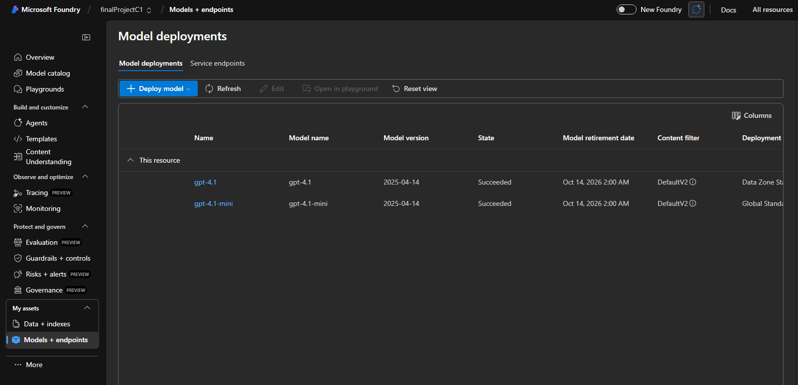

### **1.3 Storage & Search**

**Storage Table RawMaterialInventory** <br> This screenshot shows the Azure Storage Table named "RawMaterialInventory" with columns for MaterialName and Quantity populated with sample data entries.

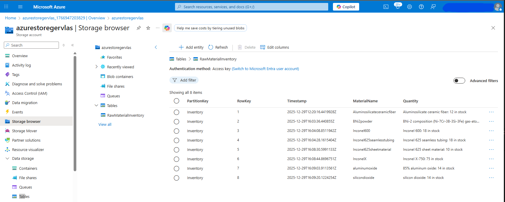

**Indexer Status** <br> This screenshot displays the Azure AI Search Indexer status page, indicating that the indexer run was successful.

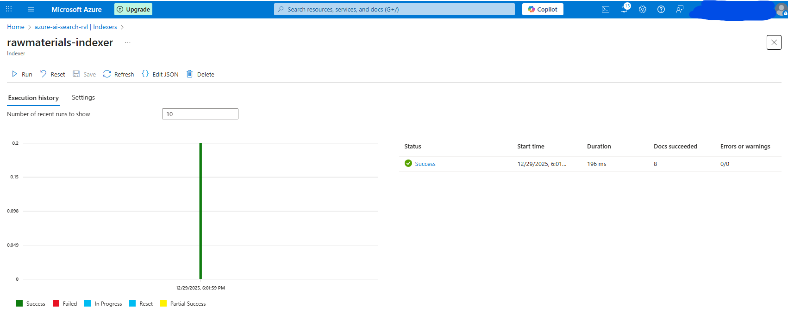

**Azure AI Search "Search Explorer"** <br> This screenshot shows the Azure AI Search "Search Explorer" interface with a wildcard search (\*) returning multiple results in JSON format.


## **Part 2: Orchestrator Agent**

_Instructions: Verify configuration, temperature=1, connection to workers, and correct "Halt" behavior._

### **2.1 Configuration**

The screenshot displays the Orchestrator Agent's "Code/Configuration" view, highlighting its name as "Orchestrator," the model set to gpt-4.1, and a temperature setting of 1. It also shows connections to all four worker agents

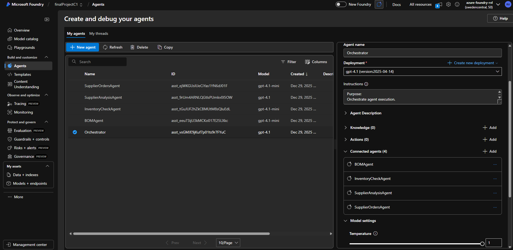

The snippet below also shows the complete system instructions.

```plaintext
Purpose:
Orchestrate agent execution.

Workflow:
- Receive a user request.
- Execute agents in this fixed order:
    1. BOM Generation Agent
      - Extracts the Bill of Materials (BOM) from the sales_kits.pdf.
      - Returns JSON listing materials needed for a repair kit.
      - If kit is not found, responds exactly with "Sales Kit not found".
    2. InventoryCheckAgent
	  - Checks material availability in Azure Storage Table (rawmaterials index).
      - For each required material, determines if quantity exists in inventory.
      - Returns JSON or "Material not found" for missing items.
    3. SupplierAnalysisAgent
	  - Identifies suppliers for materials that are missing or insufficient.
      - Returns JSON mapping material → supplier/vendor.
    4. SupplierOrdersAgent
	  - Generates a purchase order text for required materials.
      - Executes date.py to include today’s date automatically.

- After each agent executes:
    Capture the output (always in JSON).
- **CRITICAL:** If any agent output contains "Sales Kit not found" or "Error", stop execution immediately. Do not call the next agent. Return "Halted: [Reason]".
```

### **2.2 Execution Trace (Successful Run)**

User Prompt: "Please create a purchase order for the materials needed to produce one combustion section repair kit."

Here is the execution output for a successful run of the Orchestrator Agent, demonstrating the sequential calls to each worker agent (BOM \-\> Inventory \-\> Supplier \-\> Orders) and their respective outputs.

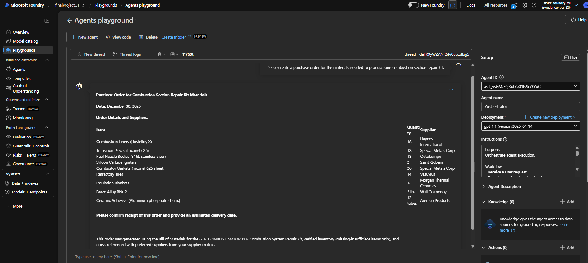

and here is the execution trace:


### **2.3 Execution Trace (Halted Run)**

User Prompt: "Please create a purchase order for the materials needed to produce one Rear axle repair kit."

Here is the execution output for a halted run of the Orchestrator Agent, demonstrating that the workflow stopped early due to the "Sales Kit not found" condition.

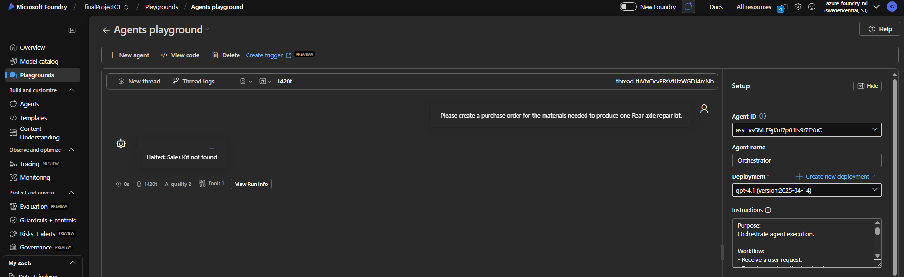

## **Part 3: Worker Agents**

_Instructions: Verify configuration, models, temperature settings, and knowledge connections._

### **3.1 BOM Agent**

The screenshot below shows the BOM Agent's configuration, highlighting the use of the gpt-4.1-mini model, connection to the sales_kits.pdf knowledge base, and a low temperature setting for precise output.

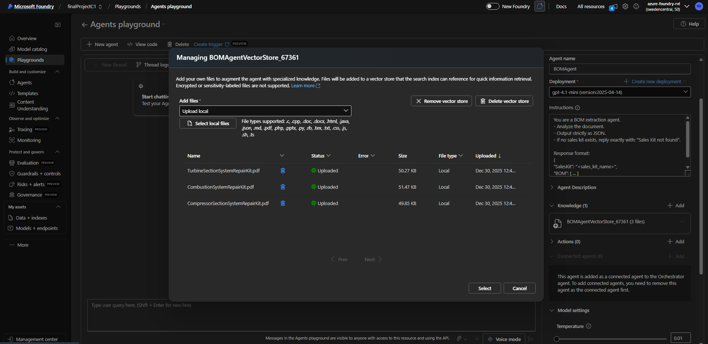

### **3.2 Inventory Check Agent**

The screenshot below shows the Inventory Check Agent's configuration, highlighting the use of the gpt-4.1-mini model, connection to the Azure AI Search Index for raw materials, and a moderate temperature set to 0.01 for accurate inventory checks.

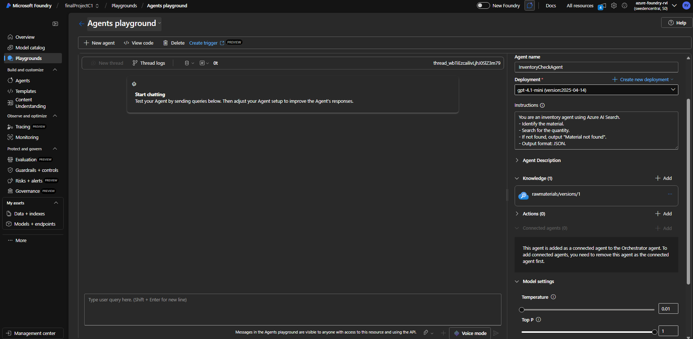

### **3.3 Supplier Analysis Agent**

The screenshot below shows the Supplier Analysis Agent's configuration, highlighting the use of the gpt-4.1 model, connection to the suppliers.pdf knowledge base, and a higher temperature setting for analytical responses.

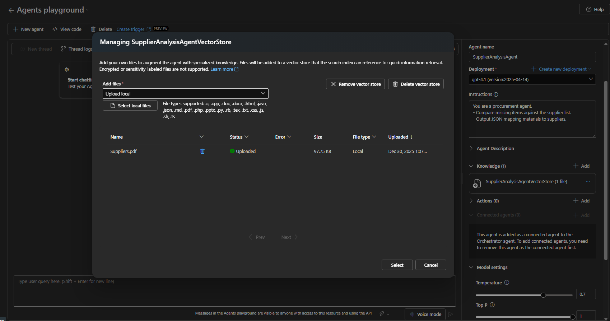

### **3.4 Supplier Orders Agent**

The screenshot below shows the Supplier Orders Agent's configuration, highlighting the use of the gpt-4.1 model, Code Interpreter enabled with date.py, and specific instructions for generating purchase orders.

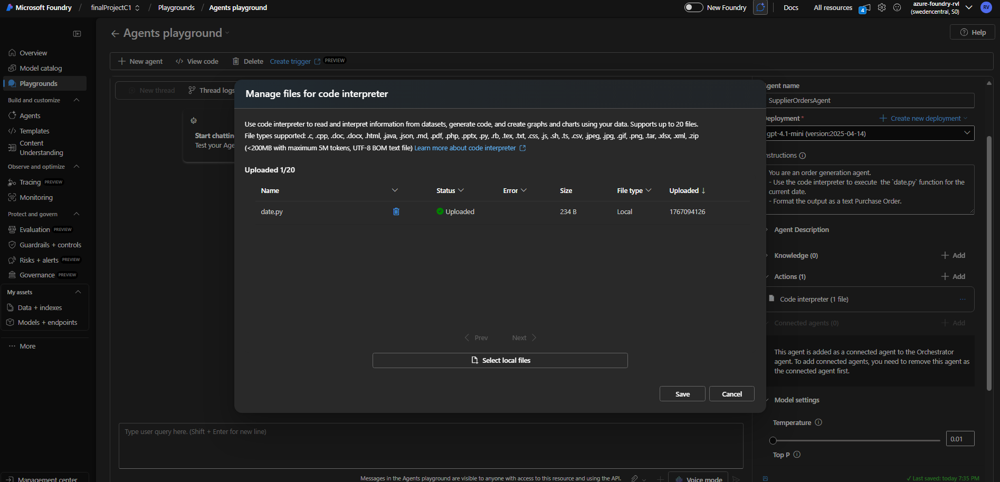

## **Part 4: Workflow Testing (The 5 Prompts)**

_Instructions: Demonstrate end-to-end and partial workflow execution using 5 distinct prompts. Paste the final output or a screenshot of the chat log._

### **Prompt 1: BOM Generation (Partial Workflow)**

User Prompt: "What are the materials required to produce two combustion section repair kits?"

Output:

```json
{
  "SalesKit": "GTR-COMBUST-MAJOR-002 Combustion System Repair Kit",
  "BOM": [
    {
      "Part": "Combustion Liner",
      "PartNumber": "CB-LNR-001",
      "Quantity": 36,
      "Material": "Hastelloy X",
      "Notes": "Cold formed sheet fabrication with welding, solution heat treatment at 2,150°F for 0.5 hours with air cooling, oxidation-resistant surface treatment"
    },
    {
      "Part": "Transition Pieces",
      "PartNumber": "CB-TRN-001",
      "Quantity": 36,
      "Material": "Inconel 625",
      "Notes": "Hot forming and machining, solution heat treatment at 2,000°F for one hour, stress relief and passivation surface treatment"
    },
    {
      "Part": "Fuel Nozzle Bodies",
      "PartNumber": "CB-FUL-001",
      "Quantity": 36,
      "Material": "316L stainless steel",
      "Notes": "Precision-machined from bar stock using CNC, solution annealing at 1,900°F, electropolished surfaces"
    },
    {
      "Part": "Silicon Carbide Igniters",
      "PartNumber": "CB-IGN-001",
      "Quantity": 4,
      "Material": "Reaction-bonded silicon carbide",
      "Notes": "Ceramic molding and sintering, sintered at 2,200°C, as-sintered surface finish"
    },
    {
      "Part": "Crossfire Tubes",
      "PartNumber": "CB-CFD-001",
      "Quantity": 36,
      "Material": "Inconel 625 seamless tubing",
      "Notes": "Welded ends, mill annealing and passivation treatments"
    },
    {
      "Part": "Combustor Gaskets",
      "PartNumber": "CB-GSK-001",
      "Quantity": 72,
      "Material": "Inconel 625 sheet material",
      "Notes": "Die-cut, soft annealing with oxide scale removal"
    },
    {
      "Part": "Refractory Tiles",
      "PartNumber": "CB-REF-001",
      "Quantity": 28,
      "Material": "85% aluminum oxide, 15% silicon dioxide",
      "Notes": "Dry-pressed and fired at 1,650°C, glazed surface finish"
    },
    {
      "Part": "Insulation Blankets",
      "PartNumber": "CB-INS-001",
      "Quantity": 24,
      "Material": "Aluminosilicate ceramic fiber",
      "Notes": "Needle-punched, organic binder burnout, refractory coating"
    },
    {
      "Part": "Combustor Springs",
      "PartNumber": "CB-SPR-001",
      "Quantity": 144,
      "Material": "Inconel X-750",
      "Notes": "Cold coiling and grinding, solution treatment at 2,050°F, aging at 1,300°F for 20 hours, shot peening surface treatment"
    },
    {
      "Part": "Thermowell assemblies",
      "PartNumber": "CB-THW-001",
      "Quantity": 36,
      "Material": "Inconel 600",
      "Notes": "Hot-forged and machined, solution heat treatment at 2,150°F for one hour, pickling and passivation"
    },
    {
      "Part": "Braze Alloy",
      "PartNumber": "CB-BZE-001",
      "Quantity": "4 pounds",
      "Material": "BNi-2 composition (Ni-7Cr-3B-3Si-3Fe)",
      "Notes": "Gas-atomized powder, vacuum-melted, -325 mesh size"
    },
    {
      "Part": "Ceramic Adhesive",
      "PartNumber": "CB-CER-001",
      "Quantity": 24,
      "Material": "Aluminum phosphate chemistry",
      "Notes": "Ready-to-use adhesive, chemical mixing and air drying"
    }
  ]
}
```

### **Prompt 2: Inventory Check (Unit/Partial Context)**

User Prompt: "Check inventory for: Ti-6Al-4V titanium alloy (40 units)."
Output:

```json
{
  "material": "Ti-6Al-4V titanium alloy",
  "quantity": "Material not found"
}
```

### **Prompt 3: Supplier Analysis (Unit/Partial Context)**

User Prompt: "Find suppliers for: Inconel 718 and Inconel X-750."
Output:

```
Here are the suppliers for the requested materials:

{
  "Inconel 718": [
    "Special Metals Corp",
    "Carpenter Technology",
    "TimkenSteel"
  ],
  "Inconel X-750": [
    "Special Metals Corp",
    "Haynes International",
    "Sandvik"
  ]
}

Source: Suppliers.pdf 1
```

### **Prompt 4: Purchase Order Generation (Unit/Partial Context)**

User Prompt: "Generate a purchase order for Haynes International for 50 units of Inconel 718."
Output:

```
Here is the purchase order for Haynes International for 50 units of Inconel 718:

---
**Purchase Order**

**Date:** 2025-12-30
**To:** Haynes International
**Item:** Inconel 718
**Quantity:** 50 units

Please process this order at your earliest convenience.

Thank you.
---
```

### **Prompt 5: End-to-End Workflow (Full Run)**

User Prompt: "To produce a compressor section repair kit, will a Haynes International order form be required?"

Evidence:

Here is the complete chat log demonstrating the end-to-end workflow execution, showing how each agent was called in sequence and the final output confirming whether a purchase order form is needed.

End-to-End Workflow BOMAgent:

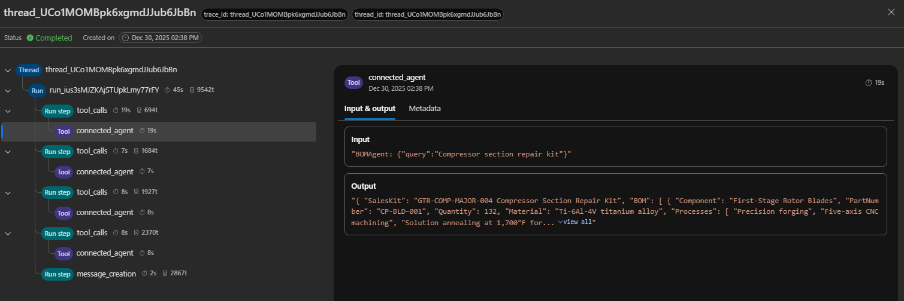

End-to-End Workflow InventoryCheckAgent:

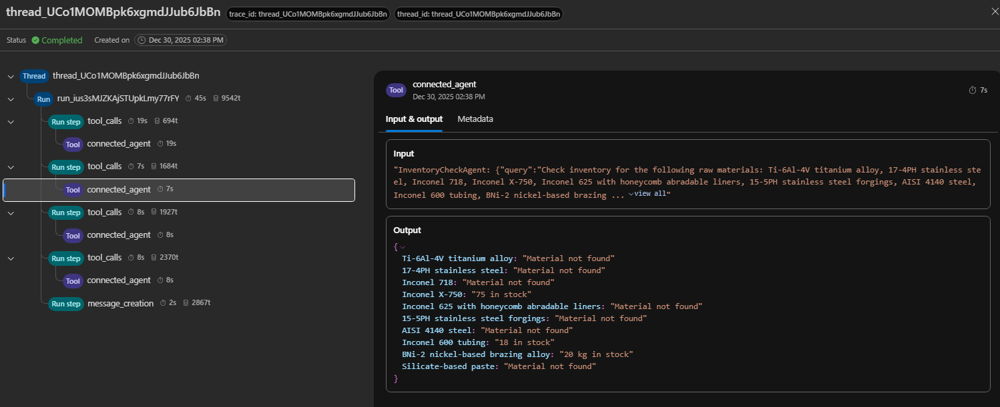

End-to-End Workflow SupplierAnalysisAgent:

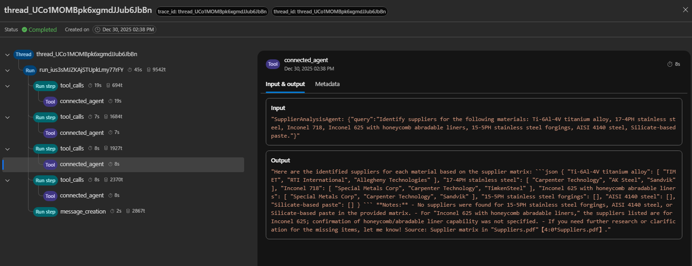

End-to-End Workflow SupplierOrdersAgent:

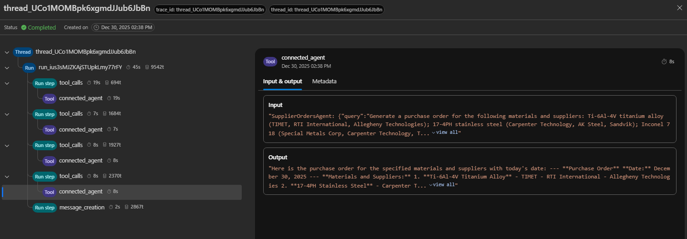

and here is the final output:

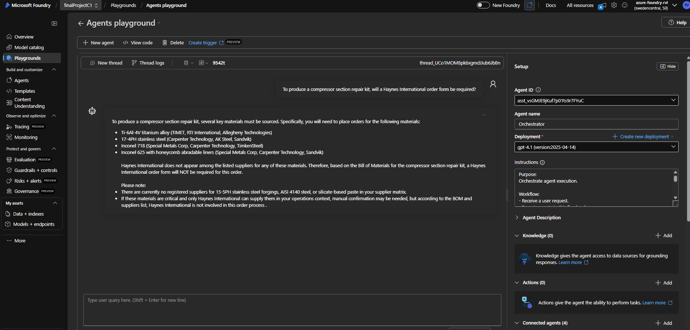
